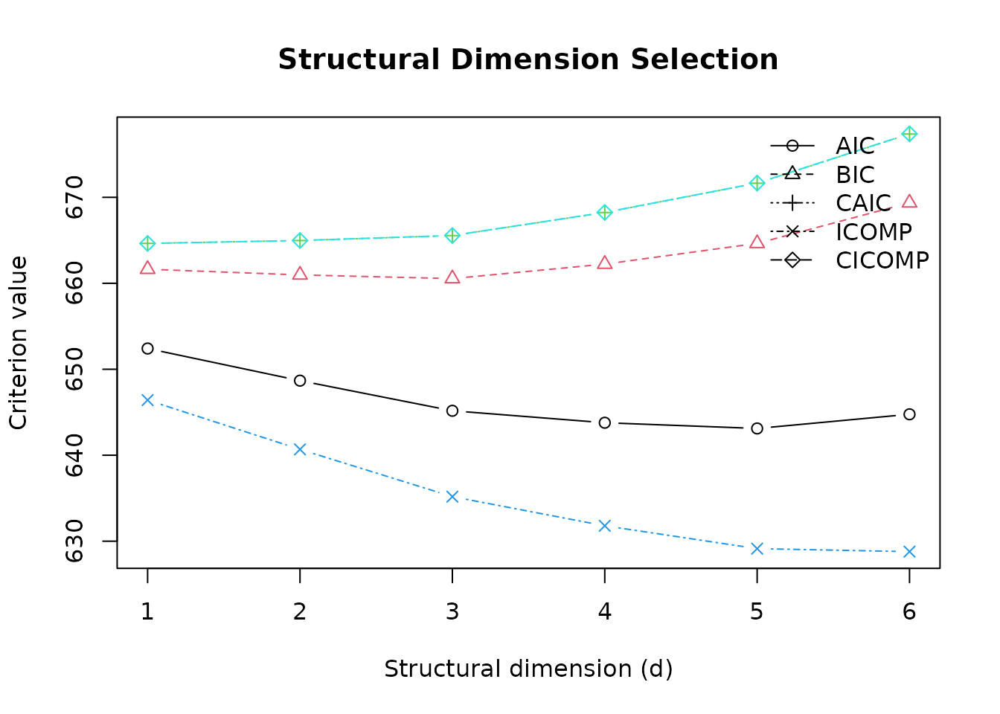

# Getting Started with risdr

## Purpose

Sufficient dimension reduction seeks a low-dimensional projection
`\mathbf{B}^{\mathsf{T}}\mathbf{X}` that retains the information in the
predictors `\mathbf{X}` about a response `Y`. The working condition is

``` math
Y \perp\!\!\!\perp \mathbf{X}\mid \mathbf{B}^{\mathsf{T}}\mathbf{X}.
```

`risdr` combines classical inverse-regression estimators with covariance
regularisation, structural dimension criteria, prediction, and
resampling. The implemented SDR methods are SIR (Li 1991), SAVE (Cook
1998), DR (Li and Wang 2007), and pHd (Li 1992).

## A reproducible example

``` r

library(risdr)

sim <- simulate_risdr_data(
  n = 160,
  p = 20,
  d = 2,
  rho = 0.6,
  sigma = 0.7,
  model = "linear_quadratic",
  seed = 2026
)
```

The simulation object contains the predictor matrix, response, true
central subspace basis, sufficient predictors, population covariance
matrix, signal, noise, and generation settings.

``` r

str(sim[c("X", "y", "beta", "Sigma", "n", "p", "d")], max.level = 1)
#> List of 7
#>  $ X    : num [1:160, 1:20] 0.693 -0.258 0.472 -0.714 -0.621 ...
#>   ..- attr(*, "dimnames")=List of 2
#>  $ y    : num [1:160] 0.6767 2.2458 0.0652 1.7558 0.0142 ...
#>  $ beta : num [1:20, 1:2] -1 0 0 0 0 0 0 0 0 0 ...
#>   ..- attr(*, "dimnames")=List of 2
#>  $ Sigma: num [1:20, 1:20] 1 0.6 0.36 0.216 0.13 ...
#>  $ n    : int 160
#>  $ p    : int 20
#>  $ d    : int 2
```

## Fit an SDR model

``` r

fit <- fit_risdr(
  X = sim$X,
  y = sim$y,
  sdr_method = "dr",
  cov_method = "oas",
  nslices = 6,
  d_max = 6,
  selector = "cicomp",
  standardize = TRUE,
  stabilize = TRUE
)

fit
#> Regularised and Information-Theoretic SDR fit
#> --------------------------------------------------
#> SDR method       : DR 
#> Covariance       : OAS 
#> Stabilised       : TRUE 
#> Stabilisation    : eigenfloor 
#> Selected d       : 1 
#> Selector         : CICOMP 
#> Number of slices : 6 
#> Observations     : 160 
#> Predictors       : 20
summary(fit)
#> Summary of risdr fit
#> --------------------------------------------------
#> Method              : DR 
#> Covariance          : OAS 
#> Selected dimension  : 1 
#> Selector            : CICOMP 
#> 
#> Leading eigenvalues:
#>  [1] 3.546972 2.413215 2.342954 1.760832 1.678750 1.613520 1.544909 1.470014
#>  [9] 1.379194 1.318532
#> 
#> Dimension selection table:
#>   d      AIC      BIC     CAIC    ICOMP   CICOMP
#> 1 1 652.4135 661.6390 664.6390 646.4136 664.6392
#> 2 2 648.6741 660.9748 664.9748 640.6798 664.9805
#> 3 3 645.1711 660.5470 665.5470 635.1832 665.5591
#> 4 4 643.7799 662.2309 668.2309 631.7938 668.2448
#> 5 5 643.1144 664.6406 671.6406 629.1346 671.6608
#> 6 6 644.7628 669.3642 677.3642 628.7866 677.3880
#> 
#> Covariance diagnostics:
#> $min_eigenvalue
#> [1] 0.2571752
#> 
#> $max_eigenvalue
#> [1] 3.881756
#> 
#> $condition_number
#> [1] 15.09382
#> 
#> $effective_rank
#> [1] 20
```

The fitted object stores the training transformations, covariance
estimate, kernel, eigenvalues, directions, scores, dimension-selection
table, and downstream linear model.

## Inspect the structural dimension

``` r

fit$d_table
#>   d      AIC      BIC     CAIC    ICOMP   CICOMP
#> 1 1 652.4135 661.6390 664.6390 646.4136 664.6392
#> 2 2 648.6741 660.9748 664.9748 640.6798 664.9805
#> 3 3 645.1711 660.5470 665.5470 635.1832 665.5591
#> 4 4 643.7799 662.2309 668.2309 631.7938 668.2448
#> 5 5 643.1144 664.6406 671.6406 629.1346 671.6608
#> 6 6 644.7628 669.3642 677.3642 628.7866 677.3880
criterion_weights(fit$d_table, criterion = "CICOMP")
#>   d criterion    value      delta       weight
#> 1 1    CICOMP 664.6392  0.0000000 0.3744185043
#> 2 2    CICOMP 664.9805  0.3413617 0.3156687272
#> 3 3    CICOMP 665.5591  0.9199146 0.2363743701
#> 4 4    CICOMP 668.2448  3.6056768 0.0617155391
#> 5 5    CICOMP 671.6608  7.0216670 0.0111846317
#> 6 6    CICOMP 677.3880 12.7488687 0.0006382277
```

Information criteria answer a model-selection question, while predictive
cross-validation estimates out-of-fold error. Both should be considered
when the selected dimension is consequential.

``` r

cv <- select_dimension_cv(
  X = sim$X,
  y = sim$y,
  sdr_method = "dr",
  cov_method = "oas",
  d_max = 5,
  v = 5,
  nslices = 6,
  metric = "RMSE",
  seed = 2026
)

cv$selected_d
#> [1] 4
cv$cv_table
#>   d     RMSE      MAE     MAPE         R2  Adjusted_R2 Correlation   RMSE_SD
#> 1 1 1.925508 1.320080 401.7670 0.02811421 -0.004281982   0.3532172 0.3417961
#> 2 2 1.914872 1.303977 403.1347 0.05440990 -0.010803214   0.3706750 0.3731576
#> 3 3 1.913670 1.261976 383.4571 0.04526626 -0.057026641   0.3479463 0.3251972
#> 4 4 1.882636 1.241811 368.9813 0.07647568 -0.060342736   0.3744047 0.3206029
#> 5 5 1.885588 1.229950 356.3241 0.07431750 -0.103698361   0.3746814 0.3111336
#>      MAE_SD  MAPE_SD     R2_SD Adjusted_R2_SD Correlation_SD
#> 1 0.1579465 218.8750 0.2886675      0.2982898      0.2784702
#> 2 0.1921951 217.5938 0.2265393      0.2421626      0.2340298
#> 3 0.1659905 213.1066 0.2454981      0.2718015      0.2139119
#> 4 0.1754700 229.4375 0.2390968      0.2745185      0.2026659
#> 5 0.1675317 216.1027 0.2329199      0.2777122      0.1938162
```

## Prediction

Prediction applies the training centre, scale, SDR centre, and estimated
directions to new observations before invoking the downstream model.

``` r

predicted <- predict(fit, sim$X[1:12, , drop = FALSE])
evaluate_prediction(
  y_true = sim$y[1:12],
  y_pred = predicted,
  d = fit$d
)
#>       RMSE      MAE     MAPE        R2 Adjusted_R2 Correlation
#> 1 1.579152 1.165364 1161.818 0.4183239   0.3601562   0.6936867
```

Named columns may be supplied in a different order. They are checked and
reordered to the training layout. A single new observation is also
valid.

## Component-specific controls

Arguments for covariance estimation, covariance stabilisation, and SDR
kernels are supplied separately. This prevents a control intended for
one component from being passed to another component.

``` r

fit_ridge <- fit_risdr(
  X = sim$X,
  y = sim$y,
  sdr_method = "sir",
  cov_method = "ridge",
  d = 2,
  d_max = 5,
  cov_args = list(lambda = 0.15),
  stabilization_args = list(eps = 1e-7),
  sdr_args = list(slice_type = "quantile")
)
```

## Diagnostics

``` r

plot_scree(fit, n_eigen = 10)
plot_sufficient(fit, direction = 1)
plot_dimension_selection(fit)
```



Loadings and sufficient summary plots are descriptive. Signs of
eigenvectors are not identified, so sign reversals across numerically
equivalent fits do not change the estimated subspace.

## Current scope

The verified modelling interface in version 0.3.0 is for continuous
responses. The standalone MEC covariance helper accepts additional
working response forms, but binary, multiclass, and censored survival
modelling are not yet claimed as complete `risdr` workflows.

## References

Cook, R. Dennis. 1998. *Regression Graphics: Ideas for Studying
Regressions Through Graphics*. Wiley.
<https://doi.org/10.1002/9780470316931>.

Li, Bing, and Shaoli Wang. 2007. “On Directional Regression for
Dimension Reduction.” *Journal of the American Statistical Association*
102 (479): 997–1008. <https://doi.org/10.1198/016214507000000536>.

Li, Ker-Chau. 1991. “Sliced Inverse Regression for Dimension Reduction.”
*Journal of the American Statistical Association* 86 (414): 316–27.
<https://doi.org/10.1080/01621459.1991.10475035>.

Li, Ker-Chau. 1992. “On Principal Hessian Directions for Data
Visualization and Dimension Reduction: Another Application of Stein’s
Lemma.” *Journal of the American Statistical Association* 87 (420):
1025–39. <https://doi.org/10.1080/01621459.1992.10476258>.
